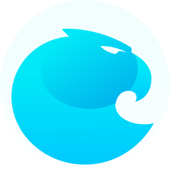

# Aragon Client 

**🌎🚀 Trusted by over 1500 organizations, securing more than $300MM in funds. [Try it out](https://client.aragon.org).**

- 📚 Read the [User Guide](https://help.aragon.org/) first, if you have any questions as a user.
- 🏗 If you'd like to develop an Aragon app, please visit the [Aragon Developer Portal](https://hack.aragon.org).
- 📝 Please report any issues and feedback in the [support channel on Discord](https://discord.gg/ZncWSEGbSJ).
- 🔧 For technical stuff, use this project's [issues](http://github.com/aragon/client/issues) or join the technical conversation in the [hacker hangout channel on Discord](https://discord.gg/XrhUzEy7jf).
- 📖 To learn more about contributing to the Aragon client itself, please check the [contributing guide](./CONTRIBUTING.md).
- 🚢 For an overview of what changed with each release, check the [releases](https://github.com/aragon/client/releases).

## Quick start

Install with `yarn` and launch the app with `yarn start`. By default, the app is configured to connect to the Ethereum Rinkeby testnet.

For connecting to other chains / deployments, a few useful npm scripts are provided:

- Ethereum Mainnet: `yarn start:mainnet` will launch the app, configured to connect to the Ethereum mainnet
- Local development: `yarn start:local` will launch the app, configured to connect to our [aragen](https://github.com/aragon/aragen) local development environment. It will also use the local IPFS daemon, if it detects one exists. If you're using the [aragonCLI](http://github.com/aragon/aragon-cli), you'll want to run this to connect to its local chain.

**Note**: Windows users may need to install the [windows-build-tools](https://www.npmjs.com/package/windows-build-tools) before installing this project's dependencies.

More [configuration options](docs/CONFIGURATION.md) are available, and depending on your needs, you may find the [frontend development setup guide](docs/FRONTEND_SETUP.md) helpful.

## Releases

The Aragon client is automatically deployed to IPFS with each new commit to `master`, via [Fleek](https://fleek.co/). The latest builds are available at [`client.aragon.org`](https://client.aragon.org/) or through an IPFS gateway, like [`ipfs.io/ipns/client.aragon.org`](https://ipfs.io/ipns/client.aragon.org/).

### aragonPM

"Checkpointed" releases, tagged in our [releases page](https://github.com/aragon/aragon/releases), are published on-chain onto the `aragon.aragonpm.eth` aragonPM repository for all supported Ethereum environments (mainnet and Rinkeby testnet).

For a long time (2018-2020), these releases were our primary "official" builds. With [Fleek](https://fleek.co/), however, we now relegate these on-chain deployments as historical backups in case a user wants to use an older version.

#### Secrets

A number of environment secrets are required during publishing and these are sometimes different per network.

You may either specify these secrets as environment variables or use a `.env`.

## Contributing

#### 👋 Get started contributing with a [good first issue](https://github.com/aragon/client/issues?q=is%3Aissue+is%3Aopen+label%3A%22good+first+issue%22).

**🎓 You may be interested in the [Aragon client architecture guide](./docs/ARCHITECTURE.md) if you're not familiar with how the project is set up.**

Don't be shy to contribute even the smallest tweak. 🐲 There are still some dragons to be aware of, but we'll be here to help you get started!

For other details about contributing to Aragon, more information is available in the [contributing guide](./CONTRIBUTING.md).

#### Issues

If you come across an issue with Aragon, do a search in the [Issues](https://github.com/aragon/client/issues?utf8=%E2%9C%93&q=is%3Aissue) tab of this repo and the [Aragon Apps Issues](https://github.com/aragon/aragon-apps/issues?utf8=%E2%9C%93&q=is%3Aissue) to make sure it hasn't been reported before. Follow these steps to help us prevent duplicate issues and unnecessary notifications going to the many people watching this repo:

- If the issue you found has been reported and is still open, and the details match your issue, give a "thumbs up" to the relevant posts in the issue thread to signal that you have the same issue. No further action is required on your part.
- If the issue you found has been reported and is still open, but the issue is missing some details, you can add a comment to the issue thread describing the additional details.
- If the issue you found has been reported but has been closed, you can comment on the closed issue thread and ask to have the issue reopened because you are still experiencing the issue. Alternatively, you can open a new issue, reference the closed issue by number or link, and state that you are still experiencing the issue. Provide any additional details in your post so we can better understand the issue and how to fix it.

#### Contributors

Thanks goes to these wonderful people ([emoji key](https://allcontributors.org/docs/en/emoji-key)):

<!-- ALL-CONTRIBUTORS-LIST:START - Do not remove or modify this section -->
<!-- prettier-ignore-start -->
<!-- markdownlint-disable -->
<table>
  <tr>
    <td align="center"><a href="https://pierre.world/"> <b>Pierre Bertet</b></a> <a href="https://github.com/aragon/client/commits?author=bpierre" title="Code">💻</a></td>
    <td align="center"><a href="http://キタ.moe"> <b>Brett Sun</b></a> <a href="https://github.com/aragon/client/commits?author=sohkai" title="Code">💻</a></td>
    <td align="center"><a href="http://AquiGorka.com"> <b>Gorka Ludlow</b></a> <a href="https://github.com/aragon/client/commits?author=AquiGorka" title="Code">💻</a></td>
    <td align="center"><a href="http://izqui.me"> <b>Jorge Izquierdo</b></a> <a href="https://github.com/aragon/client/commits?author=izqui" title="Code">💻</a></td>
    <td align="center"><a href="http://aragon.org"> <b>Luis Iván Cuende</b></a> <a href="https://github.com/aragon/client/commits?author=luisivan" title="Code">💻</a> <a href="#design-luisivan" title="Design">🎨</a> <a href="#ideas-luisivan" title="Ideas, Planning, & Feedback">🤔</a></td>
    <td align="center"><a href="http://notbjerg.me"> <b>Oliver</b></a> <a href="https://github.com/aragon/aragon/commits?author=onbjerg" title="Code">💻</a></td>
    <td align="center"><a href="https://github.com/bingen"> <b>ßingen</b></a> <a href="https://github.com/aragon/client/commits?author=bingen" title="Code">💻</a></td>
  </tr>
  <tr>
    <td align="center"><a href="http://2color.me"> <b>Daniel Norman</b></a> <a href="https://github.com/aragon/client/commits?author=2color" title="Code">💻</a></td>
    <td align="center"><a href="https://www.lightco.in"> <b>John Light</b></a> <a href="https://github.com/aragon/client/commits?author=john-light" title="Documentation">📖</a> <a href="https://github.com/aragon/client/issues?q=author%3Ajohn-light" title="Bug reports">🐛</a></td>
    <td align="center"><a href="https://github.com/Smokyish"> <b>Tatu</b></a> <a href="https://github.com/aragon/client/commits?author=Smokyish" title="Documentation">📖</a></td>
    <td align="center"><a href="https://github.com/dizzypaty"> <b>Patricia Davila</b></a> <a href="#design-dizzypaty" title="Design">🎨</a> <a href="#userTesting-dizzypaty" title="User Testing">📓</a></td>
    <td align="center"><a href="https://github.com/jounih"> <b>Jouni Helminen</b></a> <a href="#design-jounih" title="Design">🎨</a> <a href="#userTesting-jounih" title="User Testing">📓</a></td>
    <td align="center"><a href="https://github.com/lkngtn"> <b>Luke Duncan</b></a> <a href="#ideas-lkngtn" title="Ideas, Planning, & Feedback">🤔</a></td>
    <td align="center"><a href="http://danielconstantin.net/"> <b>Daniel Constantin</b></a> <a href="https://github.com/aragon/client/commits?author=0x6431346e" title="Code">💻</a></td>
  </tr>
  <tr>
    <td align="center"><a href="https://rjewing.com"> <b>RJ Ewing</b></a> <a href="https://github.com/aragon/client/commits?author=ewingrj" title="Code">💻</a></td>
    <td align="center"><a href="https://twitter.com/0xca0a"> <b>Paul Henschel</b></a> <a href="https://github.com/aragon/client/commits?author=drcmda" title="Code">💻</a></td>
    <td align="center"><a href="https://github.com/rperez89"> <b>Rodrigo Perez</b></a> <a href="https://github.com/aragon/client/commits?author=rperez89" title="Code">💻</a></td>
    <td align="center"><a href="http://www.gasolin.idv.tw"> <b>gasolin</b></a> <a href="https://github.com/aragon/client/commits?author=gasolin" title="Code">💻</a></td>
    <td align="center"><a href="http://adamsoltys.com/"> <b>Adam Soltys</b></a> <a href="https://github.com/aragon/client/commits?author=asoltys" title="Code">💻</a></td>
    <td align="center"><a href="https://github.com/arku"> <b>Arun Kumar</b></a> <a href="https://github.com/aragon/client/commits?author=arku" title="Code">💻</a></td>
    <td align="center"><a href="https://github.com/bvanderdrift"> <b>Beer van der Drift</b></a> <a href="https://github.com/aragon/client/commits?author=bvanderdrift" title="Code">💻</a></td>
  </tr>
  <tr>
    <td align="center"><a href="https://github.com/danielcaballero"> <b>Daniel Caballero</b></a> <a href="https://github.com/aragon/client/commits?author=danielcaballero" title="Code">💻</a></td>
    <td align="center"><a href="https://twitter.com/deamlabs"> <b>Deam</b></a> <a href="https://github.com/aragon/client/commits?author=deamme" title="Code">💻</a></td>
    <td align="center"><a href="https://github.com/uniconstructor"> <b>Ilia Smirnov</b></a> <a href="https://github.com/aragon/client/commits?author=uniconstructor" title="Documentation">📖</a> <a href="#tool-uniconstructor" title="Tools">🔧</a></td>
    <td align="center"><a href="https://github.com/JulSar"> <b>julsar</b></a> <a href="https://github.com/aragon/client/commits?author=JulSar" title="Documentation">📖</a></td>
    <td align="center"><a href="https://pascalprecht.github.io"> <b>Pascal Precht</b></a> <a href="#tool-PascalPrecht" title="Tools">🔧</a></td>
    <td align="center"><a href="https://rudygodoy.com"> <b>Rudy Godoy</b></a> <a href="https://github.com/aragon/client/commits?author=rudygodoy" title="Documentation">📖</a></td>
    <td align="center"><a href="http://spacedecentral.net"> <b>Yalda Mousavinia</b></a> <a href="https://github.com/aragon/client/commits?author=stellarmagnet" title="Code">💻</a></td>
  </tr>
  <tr>
    <td align="center"><a href="https://github.com/decodedbrain"> <b>decodedbrain</b></a> <a href="https://github.com/aragon/client/commits?author=decodedbrain" title="Code">💻</a></td>
    <td align="center"><a href="https://github.com/jvluso"> <b>jvluso</b></a> <a href="https://github.com/aragon/client/commits?author=jvluso" title="Code">💻</a></td>
    <td align="center"><a href="https://github.com/MarkGeeRomano"> <b>mark g romano</b></a> <a href="https://github.com/aragon/client/commits?author=MarkGeeRomano" title="Code">💻</a></td>
    <td align="center"><a href="https://github.com/mul53"> <b>mul53</b></a> <a href="https://github.com/aragon/client/commits?author=mul53" title="Code">💻</a></td>
    <td align="center"><a href="https://github.com/Schwartz10"> <b>Jon</b></a> <a href="https://github.com/aragon/client/commits?author=Schwartz10" title="Code">💻</a></td>
    <td align="center"><a href="https://github.com/abhinavsagar"> <b>Abhinav Sagar</b></a> <a href="#maintenance-abhinavsagar" title="Maintenance">🚧</a></td>
    <td align="center"><a href="http://geleeroyale.netlify.com"> <b>geleeroyale</b></a> <a href="https://github.com/aragon/client/commits?author=geleeroyale" title="Documentation">📖</a></td>
  </tr>
  <tr>
    <td align="center"><a href="https://github.com/ottodevs"> <b>Otto G</b></a> <a href="https://github.com/aragon/client/commits?author=ottodevs" title="Code">💻</a></td>
    <td align="center"><a href="https://adamboro.com/"> <b>Adam Boro</b></a> <a href="https://github.com/aragon/client/commits?author=adekbadek" title="Code">💻</a></td>
    <td align="center"><a href="https://github.com/e18r"> <b>Emilio Silva Schlenker</b></a> <a href="https://github.com/aragon/client/commits?author=e18r" title="Code">💻</a></td>
    <td align="center"><a href="https://github.com/osarrouy"> <b>Olivier Sarrouy</b></a> <a href="https://github.com/aragon/client/commits?author=osarrouy" title="Code">💻</a></td>
    <td align="center"><a href="https://github.com/delfipolito"> <b>delfipolito</b></a> <a href="https://github.com/aragon/client/commits?author=delfipolito" title="Code">💻</a></td>
    <td align="center"><a href="http://enriqueortiz.dev"> <b>Enrique Ortiz</b></a> <a href="https://github.com/aragon/client/commits?author=Evalir" title="Code">💻</a></td>
    <td align="center"><a href="https://github.com/fabriziovigevani"> <b>Fabrizio Vigevani</b></a> <a href="https://github.com/aragon/client/commits?author=fabriziovigevani" title="Code">💻</a></td>
  </tr>
  <tr>
    <td align="center"><a href="https://github.com/macor161"> <b>Mathew Cormier</b></a> <a href="https://github.com/aragon/client/commits?author=macor161" title="Code">💻</a></td>
    <td align="center"><a href="https://mickdegraaf.nl"> <b>Mick de Graaf</b></a> <a href="#business-MickdeGraaf" title="Business development">💼</a></td>
    <td align="center"><a href="http://iwaduarte.dev"> <b>iwaduarte</b></a> <a href="https://github.com/aragon/client/commits?author=iwaduarte" title="Code">💻</a></td>
    <td align="center"><a href="http://valtechcreative.com"> <b>EC Wireless</b></a> <a href="https://github.com/aragon/client/commits?author=ECWireless" title="Code">💻</a></td>
    <td align="center"><a href="https://github.com/owisixseven"> <b>owisixseven</b></a> <a href="#design-owisixseven" title="Design">🎨</a></td>
    <td align="center"><a href="https://andyhook.dev"> <b>Andy Hook</b></a> <a href="https://github.com/aragon/client/commits?author=andy-hook" title="Code">💻</a></td>
  </tr>
</table>

<!-- markdownlint-enable -->
<!-- prettier-ignore-end -->
<!-- ALL-CONTRIBUTORS-LIST:END -->

This project follows the [all-contributors](https://github.com/all-contributors/all-contributors) specification. Contributions of any kind welcome!

## Re-usable foundations

Amongst other dependencies, the Aragon client is built upon these packages that you may also find useful for your projects:

- [aragonUI](https://github.com/aragon/aragon-ui): React component library used to build user interfaces within the [Aragon design system](https://blog.aragon.org/introducing-aragonds-the-new-aragon-design-system/)
- [token-amount](http://github.com/aragon/token-amount): utility class for encapsulating and formatting a token amount
- [use-inside](https://github.com/aragon/use-inside): React utility that allows a component to be aware of being "inside" the subtree of another component
- [use-token](https://github.com/aragon/use-token): React utility for fetching information related to tokens on Ethereum
- [use-viewport](https://github.com/aragon/use-viewport): React utility providing the current window size and convenient functions for responsive apps
- [use-wallet](https://github.com/aragon/use-wallet): React utility aiming to make the integration between your dapp and your users' web3 wallets as straightforward as possible
- [web3-react](https://github.com/NoahZinsmeister/web3-react): a simple, maximally extensible React framework for supporting arbitrary web3 wallets
